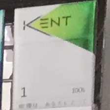

# Signate-Tobacco

### Japan Tobacco Industry Image detection of tobacco products.

The aim of competition was to detect cigarette packs on the shelf and then classify their brand.

*Data is restricted, but it can be found [here](https://signate.jp/competitions/159).*

#### Data:
* Shelf images: high resolution shelf photos with tens and hundreds of packs. Size of 2448\*3264 or 3264\*2448 px;
* Master images: high resolution brand images;
* Annotations for train images with boundary box coordinates and brand classes.

#### Samples are: 
##### Train images:

  
   

##### Master images:

   

#### Main difficulties:
* Pictures were large and it was hard to process them on GPU. So they were needed to be accurately cropped. The most difficult part was to maintain right box coordinates in cropped pictures when predicting test puctures. To resize pictures would be a bad idea because some pictures were not clear enough;
* Choose between detection and classification or first detection and then classification. I tried both, thecond was better; 
* Using master images. It was not clear from rules. Some participants extracted features from them. Some did something else. I augumented those images and added to train;
* Choose the best box and class for predicted image when averaging predictions;
* Fix some prediction bugs, for example when model predict one boundary box for two images at once.

#### Tech stack:
* pytorch
* mmdetection
* fastai
* pretrainedmodels
* albumentations
* cv2

#### Models:
* Detecting packs: faster rcnn with resnet101 backbone, 12 epochs
* (se_resnext50_32x4d, densenet161, resnet152, resnet101) \* 10 folds

#### Code:
##### make_annotations.py
Write new annotations for cropped images and crop squares. Raw images (2448\*3264 or 3264\*2448 px) are cropped in 816\*816 px squares with 408 px indent. So if you have image of size 1632\*816 px, you would have three 816\*816 px cropped images.

Make remap_dict to map original classes to range(1, class_amount+1).

###### Resized images:

  
   

##### crop_square_train.py 
Crop every single pack from train images and put it in folder of it's brand. It works better if cut not rectangle original boundary boxes, but make square from it. Because there is a lot of information on the pic's edges, so square will save more information when random augumentations would apply duaring learning.

###### Cropped images:

  
   
   
   

##### run detector
I choose faster_rcnn_r101_fpn_1x with resnet101 backbone. Config in 'configs' directory.
##### predict_and_crop_test.py
Predict test boxes and crop images at once.
##### remake_master.py
Augument master images and add to train folders.

###### Augumented images:

  
   
   
  
   

##### make_folds.py
Devide train pictures into folders for further cross validation. 
##### training.py
Train chosen models.
##### prediction.py
Predict train and predict validation for stacking. But I hadn't time to implement stacking, so I just average all test predictions and don't use validation predictions.
##### make submition
Averege all test predictions and write submission.

#### Things that I also had to do:
* Extract feature vectors from master images to classify brands which were not in train set.
* Use several models and cross validation on detection stage, not only on classifying stage.

(List could be extended if I knew detailes from other participants)
